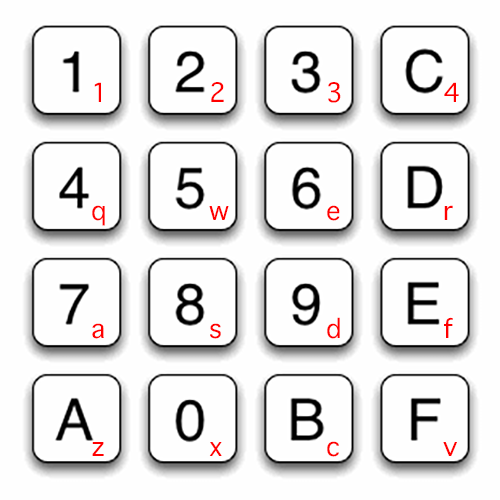

# chip8

Text about what this is...


## Compiling

Create buildfiles (usually Unix Makefiles)
```sh
mkdir build
cd build
cmake ../src
```

### Linux/MacOS

Just run `make` in the build directory.

### Windows

Run `MSBuild` on any of the `.vcxproj` files, or open the whole `Project.sln` solution in Visual Studio.
You'll have to set the working directory to `..\..\bin\Debug` for chip8gl (for it to find the roms).


## Roms

You can download a few roms from [Zophar's Domain](https://www.zophar.net/pdroms/chip8/chip-8-games-pack.html)


## Keypad

The CHIP-8 has a keypad with 16 buttons (1,2...8,9,A,B,C,D,E,F).  
The red letters are the keys on your keyboard that are bound to the CHIP-8 keypad.




## References

- [arnsa/Chip-8-Emulator](https://github.com/arnsa/Chip-8-Emulator/blob/master/chip8.c)
- [Cowgod's Chip-8 Technical Reference](http://devernay.free.fr/hacks/chip8/C8TECH10.HTM)
- [JamesGriffin/CHIP-8-Emulator](https://github.com/JamesGriffin/CHIP-8-Emulator/blob/master/src/chip8.cpp)
- [(Super)CHIP 8 Secrets](https://github.com/AfBu/haxe-CHIP-8-emulator/wiki/(Super)CHIP-8-Secrets)


## Third-party code used

- [Glad](http://glad.dav1d.de/#profile=core&language=c&specification=gl&loader=on&api=gl=3.3)
- [ocornut/imgui](https://github.com/ocornut/imgui)
- [ocornut/imgui_memory_editor.h](https://github.com/ocornut/imgui_club/blob/master/imgui_memory_editor/imgui_memory_editor.h)
